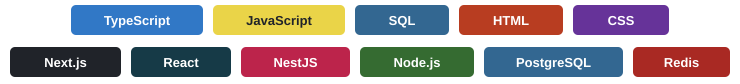
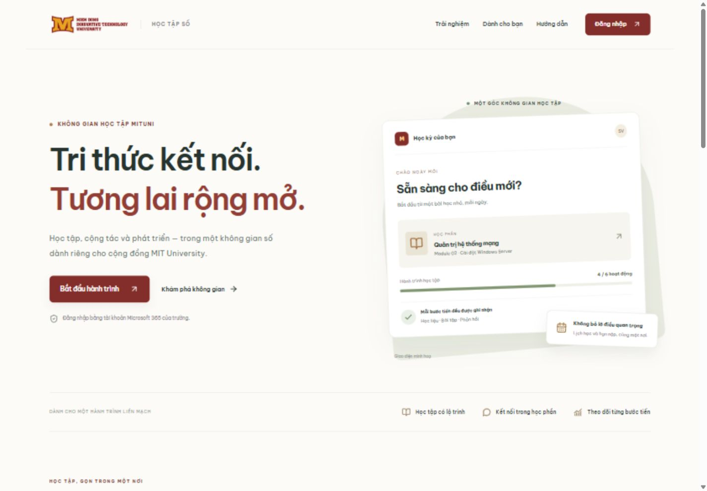
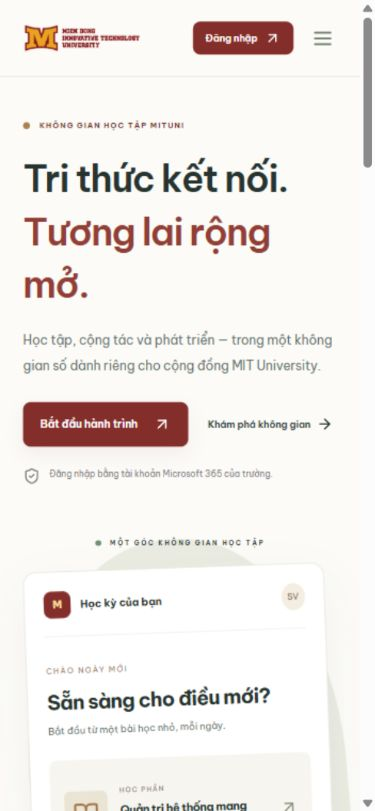
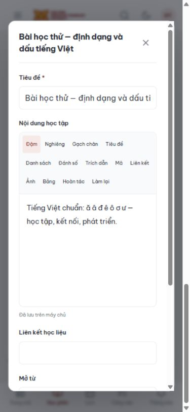

<p align="center">
  
</p>

<h1 align="center">MITUNI LMS</h1>

<p align="center">A learning management system for course delivery, assessment, and academic administration.</p>

<p align="center">
  
</p>

<p align="center">
  <a href="#quick-start">Quick start</a> · <a href="#architecture">Architecture</a> · <a href="#configuration">Configuration</a> · <a href="#testing-and-verification">Testing</a> · <a href="#deployment">Deployment</a>
</p>

## Overview

MITUNI LMS is a full-stack web application for students, teaching staff, and academic administrators. It brings course content, assignments, quizzes, grades, attendance, and course-level collaboration into a single application.

The project is organized as an npm-workspaces monorepo with a Next.js frontend and a NestJS REST API. PostgreSQL is the production data store; local development can use an embedded PGlite database without provisioning external infrastructure.

**Project status:** active development and internal validation. The application is not yet approved for institution-wide production use. It is an independent implementation using MITUNI branding, not a replica of the university's Moodle backend. Demo records are stored locally and are not synchronized with the university's existing LMS.

The application interface is primarily Vietnamese. This English README does not imply complete English localization of the product.

## Contents

- [Functional scope](#functional-scope)
- [Interface preview](#interface-preview)
- [Technology stack](#technology-stack)
- [Architecture](#architecture)
- [Quick start](#quick-start)
- [Configuration](#configuration)
- [Development workflow](#development-workflow)
- [Repository structure](#repository-structure)
- [Data storage and migrations](#data-storage-and-migrations)
- [Authentication and authorization](#authentication-and-authorization)
- [External integrations](#external-integrations)
- [Testing and verification](#testing-and-verification)
- [Mobile and offline behavior](#mobile-and-offline-behavior)
- [Deployment](#deployment)
- [Troubleshooting](#troubleshooting)
- [Known limitations](#known-limitations)
- [Project documentation](#project-documentation)

## Functional scope

### Course delivery

- Course-section views with enrolled users, module organization, learning activities, and completion tracking.
- Draft, published, and scheduled content states, with prerequisites controlling access to subsequent activities.
- Rich-text editing with tables, links, and images; autosave, revision history, restoration, and draft duplication.
- Optimistic revision checks to reject stale updates instead of silently overwriting newer content.
- JSON learning-package export, validation preview, and confirmed import of modules, content, and question-bank entries.
- Course file libraries with private, course-level, and group-level access scopes.

Learning-package imports create drafts. They do not copy binary attachments, assignments, quiz definitions, enrollment records, grades, schedules, or prerequisite relationships.

### Assignments and assessment

- Text, link, and file submissions, with submission history and idempotency handling.
- Assignment deadlines, late-submission rules, attempt limits, rubrics, and instructor feedback.
- A teaching queue for assignment submissions and quiz responses awaiting manual grading.
- Question-bank validation, attempt snapshots, question shuffling, autosave, server-side time limits, and automatic submission on expiry.
- Automatic scoring where applicable, manual review for essay and file-upload responses, and configurable answer-review policies.

Supported question types:

| Type | Identifier |
| --- | --- |
| Single choice | `SINGLE_CHOICE` |
| Multiple choice | `MULTIPLE_CHOICE` |
| True or false | `TRUE_FALSE` |
| Short answer | `SHORT_ANSWER` |
| Essay | `ESSAY` |
| Numeric response | `NUMERIC` |
| Matching | `MATCHING` |
| Ordering | `ORDERING` |
| Fill in the blank | `FILL_BLANK` |
| File upload | `FILE_UPLOAD` |

### Grades, attendance, and learning outcomes

- Separate draft and released grade states; students can access only released grades.
- Weighted grade calculations, validation of weight totals, paginated gradebook views, and permission-filtered CSV export.
- Attendance sessions with manual recording and time-limited check-in codes.
- Course learning outcome (CLO) mappings, weighted attainment reporting, and CSV output.
- Course progress summaries and rule-based activity indicators.

Gradebook CSV exports currently support up to 10,000 rows. Program-level accreditation reporting and multi-stage grade approval are outside the current implementation.

### Collaboration and administration

- Course discussions, announcements, scheduled notifications, and read-state tracking.
- Internal messaging, calendar views, personal tasks, and course-related events.
- Group membership, discussion spaces, and member-restricted files.
- User administration, configurable role permissions, course-section status management, and audit records.
- Student Information System (SIS) JSON imports with preview, transactional execution, and external-ID upserts.
- Private support requests, administrator responses, and ticket-status management.

See [the feature matrix](docs/FEATURES.md) for the implementation and gap assessment.

## Interface preview

The landing page uses the existing MITUNI visual identity and self-hosted Be Vietnam Pro fonts. The hero illustration is a sample interface, not an individual student's academic record.



<details>
<summary>Mobile interface</summary>

<p>
  
  
</p>

</details>

Screenshots are from the local verification session on 29 September 2026. Viewport checks do not substitute for testing on physical Android or iOS devices.

## Technology stack

| Layer | Implementation | Purpose |
| --- | --- | --- |
| Languages | TypeScript, JavaScript, SQL, HTML, CSS | Application logic, scripts, relational queries, markup, and styling |
| Web application | Next.js 16, React 19 | Routing, page rendering, and interactive UI |
| API | NestJS 11, Express 5 | HTTP endpoints and domain modules |
| Runtime | Node.js; package engine requirement `>=22` | Application and development tooling |
| Database | PostgreSQL, PGlite, `pg` | Relational persistence and local embedded development |
| Background processing | BullMQ, Redis | Scheduled maintenance and queue execution |
| Identity | Microsoft Entra ID, MSAL Node | OpenID Connect and authorization-code flow with PKCE |
| File storage | Local filesystem, Azure Blob Storage SDK | Development files and production object storage |
| Content authoring | Tiptap, DOMPurify, sanitize-html | Rich-text editing and HTML sanitization |
| Validation | Zod | Request and domain-input validation |
| UI assets | Lucide, Be Vietnam Pro | Icons and locally served Vietnamese typography |
| Testing | Node.js test runner, strict assertions | API integration, migration, authentication SDK, and scoring tests |
| Packaging | npm workspaces, Docker, Docker Compose | Dependency management and deployment configuration |

Version ranges are defined in the workspace manifests; exact resolution is recorded in `package-lock.json`. The badges describe the implementation, not build status or security certification.

## Architecture

The backend is a **modular monolith**, not a collection of independently deployed microservices. The startup script runs the web server and API as separate processes. Business rules, authorization checks, and database access remain on the API side.

```text
Browser / PWA
      |
      v
Next.js web server :3000
      |
      | Same-origin rewrites: /api/*, /auth/*, /health/*
      v
NestJS API :4100
      |
      +-- PostgreSQL / PGlite     Academic records, sessions, audit data
      +-- Local files / Blob     Access-controlled uploaded content
      +-- Redis + BullMQ         Scheduled maintenance when configured
      +-- Entra ID / Graph       Identity and calendar integrations
```

The web application forwards API, authentication, and health requests to the internal API origin. Keeping browser requests on the web origin supports cookie-based sessions and Origin enforcement. The API binds to loopback by default.

### Domain boundaries

- **Identity and access:** authentication, sessions, role permissions, and enrollment checks.
- **Course delivery:** course sections, modules, content revisions, learning packages, and completion.
- **Assessment:** assignments, submissions, rubrics, quizzes, scoring, grades, and attendance.
- **Collaboration:** discussions, messages, groups, notifications, calendar entries, and support.
- **Administration and integration:** users, SIS imports, audit records, Microsoft integration, and configuration status.
- **Infrastructure:** relational storage, file access, migration execution, and recurring maintenance.

### Execution modes

| Concern | Local development | Production requirements |
| --- | --- | --- |
| Identity | Demo personas; optional configured Entra integration | Configured Entra ID; demo login disabled |
| Database | PGlite unless `DATABASE_URL` is set | PostgreSQL |
| Background jobs | In-process maintenance every 15 seconds without Redis | Redis and BullMQ |
| Uploaded files | Local filesystem when Azure is not configured | Private Azure Blob container |
| Transport | Loopback HTTP | HTTPS through a reverse proxy |
| Seed data | Demo dataset initialized once | Controlled initial administrator provisioning |

Production startup validates mandatory configuration. It does not validate institutional approval, integration behavior, or operational readiness.

## Quick start

### Prerequisites

- Node.js 22 or later; the current development and Docker environments use Node.js 24.
- npm.
- Available local ports: `3000` for the web application and `4100` for the API.
- Port `4101` available when running the API integration tests.

Docker, a separate PostgreSQL server, Redis, and Microsoft credentials are not required for the default local demo.

### Install dependencies

Run commands from the project root. For the current Windows checkout:

```powershell
cd 'D:\LMS MITUNI'
npm ci
```

The absolute path is specific to this checkout; other environments should use their own project directory. `npm ci` installs the dependency versions recorded in the lockfile.

### Start development servers

```powershell
npm run dev
```

Open [http://localhost:3000](http://localhost:3000). Select **Đăng nhập** and choose a demo persona:

| UI label | Role |
| --- | --- |
| Sinh viên | Student |
| Giảng viên | Lecturer |
| Quản trị | Administrator |

Demo actions persist in the local database. They do not update the university's existing systems.

Keep the terminal open while using the application. Stop both processes with `Ctrl+C`. Do not launch another instance on the same ports.

On Windows, `START-LMS.bat` is an alternative launcher. It runs `npm install` only when `node_modules` is absent; use `npm ci` explicitly for a lockfile-based installation.

## Configuration

The default local demo can start without an `.env` file. To customize the API configuration, create `.env` from [.env.example](.env.example) without overwriting an existing file:

```powershell
if (-not (Test-Path -LiteralPath '.env')) {
    Copy-Item -LiteralPath '.env.example' -Destination '.env'
}
```

Keep secrets out of source control. The repository ignores local environment files and `.data`; this is not a substitute for reviewing files before publication.

### Application and infrastructure

| Variable | Local default or behavior | Notes |
| --- | --- | --- |
| `NODE_ENV` | Set to `development` by `npm run dev` | `npm start` sets `production` |
| `APP_URL` | `http://localhost:3000` | Must match the browser origin; HTTPS required in production |
| `DEMO_MODE` | Enabled outside production when unset | Set to `false` for production |
| `API_PORT` | `4100` | NestJS listening port |
| `API_HOST` | `127.0.0.1` | API binding; keep the API internal |
| `HOST` | `127.0.0.1` | Web binding read by the startup script from its process environment |
| `API_ORIGIN` | `http://127.0.0.1:4100` | Next.js rewrite destination |
| `DATABASE_URL` | Empty: use PGlite in development | Required PostgreSQL connection string in production |
| `DATA_DIR` | `.data/postgres` | Embedded database directory override |
| `REDIS_URL` | Empty: use the development scheduler | Required in production |
| `AZURE_STORAGE_CONNECTION_STRING` | Empty: local file storage | Required in production; treat as a secret |
| `AZURE_STORAGE_CONTAINER` | `lms-files` in the example configuration | Provision a private container |
| `POSTGRES_PASSWORD` | No default | Required by Docker Compose's PostgreSQL service |

The API loads the root `.env` through `dotenv`. The startup script itself does not load that file before selecting the web binding, and Next.js configuration is evaluated in the web workspace. Set launcher/web variables such as `HOST` and `API_ORIGIN` in the process environment when required. If the API port changes, update the web rewrite origin as well. For production builds, make the intended rewrite configuration available at build time.

### Identity and bootstrap

| Variable | Purpose |
| --- | --- |
| `ENTRA_TENANT_ID` | Allowed Microsoft Entra tenant |
| `ENTRA_CLIENT_ID` | Registered application client ID |
| `ENTRA_CLIENT_SECRET` | Confidential-client credential; server-side only |
| `ENTRA_REDIRECT_URI` | Registered callback; local example: `http://localhost:3000/auth/microsoft/callback` |
| `TOKEN_ENCRYPTION_KEY` | Base64-encoded 32-byte key for server-side token-cache encryption |
| `BOOTSTRAP_ADMIN_OID` | Entra object ID of the initial administrator on a fresh database |
| `BOOTSTRAP_ADMIN_EMAIL` | Email for initial administrator provisioning |

Generate an encryption key locally, store it securely, and do not include the output in commits or shared logs:

```powershell
node -e "console.log(require('crypto').randomBytes(32).toString('base64'))"
```

Do not replace an existing encryption key without a migration or recovery plan for encrypted token caches.

### SIS configuration

`SIS_BASE_URL` and `SIS_API_TOKEN` are placeholders for future integration work. They do not currently enable automatic synchronization. The implemented workflow imports JSON with a validation preview followed by an explicit execute step.

## Development workflow

| Command | Description |
| --- | --- |
| `npm ci` | Install dependencies from the lockfile |
| `npm run dev` | Compile the API, then start the API and Next.js development server |
| `npm run typecheck` | Type-check both workspaces |
| `npm run build` | Compile the API and create the production web build |
| `npm test` | Run the Node.js test suites |
| `npm start` | Start previously built artifacts in production mode |
| `npm run build -w apps/api` | Rebuild the API workspace |
| `npm run build -w apps/web` | Build the web workspace |

Next.js updates frontend code during development. The API is compiled once by the launcher and does **not** run in watch mode. Restart `npm run dev` after changing backend code.

For a verification pass:

```powershell
npm run typecheck
npm run build
npm test
```

Run tests after building: the integration suite starts `apps/api/dist/main.js`, so an outdated build can test stale code. Avoid running multiple test suites concurrently against port `4101`.

## Repository structure

```text
apps/
  api/
    src/
      admin/             User administration, permissions, SIS, audit
      auth/              Authentication, sessions, Microsoft login
      collaboration/     Discussions, messaging, calendar, support
      courses/           Course sections, modules, learning activities
      db/                Database adapter, schema, migrations, seed
      files/             Upload, validation, sharing, download authorization
      integrations/      Microsoft Graph integration
      learning/          Assignments, quizzes, scoring, grades, attendance
      content.ts         Content sanitization and revision handling
      packages.ts        Learning-package preview, export, and import
      workspace.ts       Groups, teaching queue, support, CLO reports
      jobs.ts            Scheduled maintenance
      main.ts            Application bootstrap and health endpoints
  web/
    app/                 Next.js App Router entry points and global styles
    src/                 Application shell and feature components
    public/              Branding, icons, manifest, and service worker
docs/                    Feature scope, deployment notes, QA evidence
scripts/                 Process launcher
tests/                   Automated test suites
.env.example             Configuration template
compose.yml              PostgreSQL, Redis, and production app services
Dockerfile               Build and runtime container configuration
package-lock.json        Resolved dependency versions
START-LMS.bat            Windows development launcher
```

Root-level `index.html`, `app.js`, `catalog.js`, `data.js`, `styles.css`, `fidelity.css`, and `start-server.bat` belong to the earlier static prototype. They are retained for reference and are not entry points for the current application.

## Data storage and migrations

### Local persistence

| Path | Contents |
| --- | --- |
| `.data/postgres` | Default embedded database |
| `.data/files` | Local uploaded files |
| `.data/test-runs` | Isolated test-run data |
| `.data/backups` | Backup copies, when created; not an automated backup service |

The demo dataset is initialized once and retained across restarts. Restarting the server does not reset records. Do not delete `.data` as a troubleshooting shortcut.

### Schema changes

The API applies versioned SQL migrations before serving requests:

1. `apps/api/src/db/schema.sql` is the immutable `001_initial` baseline.
2. Additional migrations live in `apps/api/src/db/migrations/`.
3. `schema_migrations` records the version, SHA-256 checksum, and application timestamp.
4. Already-applied migrations are checked for checksum consistency.
5. Missing migration sources or changed checksums cause startup to fail.

Migration execution is transactional. The PostgreSQL path also acquires an advisory transaction lock to serialize concurrent migration attempts.

Add a new migration, for example `003_add_feature.sql`, rather than editing an applied file. Ship all migration sources with the application. Automatic down-migrations are not implemented; rollback requires a tested restore procedure or a forward corrective migration.

### Backup and recovery

Stop the application before copying the embedded PGlite database. Preserve uploaded files together with the corresponding database state.

For production, establish PostgreSQL backups, object-storage recovery, protected configuration backups, and retention policies. Restore into a separate staging environment and verify users, enrollment, submissions, grades, and file access before switching traffic. Recovery-time and recovery-point objectives have not yet been validated.

## Authentication and authorization

Production authentication uses Microsoft Entra ID. The local persona selector is a development facility, not a production password-based authentication system.

Implemented controls include:

- HttpOnly session cookies, `SameSite=Lax`, and secure cookies for HTTPS configuration.
- Origin checks and CSRF-token validation for protected mutations.
- Server-side permission checks combined with course-enrollment checks.
- Session revocation and denial of access for disabled users.
- Server-side encrypted Microsoft token caches; no access-token storage in browser `localStorage`.
- Separation between draft grades and student-visible released grades.
- HTML sanitization and file-content checks.
- Audit records for selected administrative, grade, and import operations.

These controls have local automated coverage but have not undergone an independent security assessment. Role declarations alone do not establish complete faculty/department scoping or multi-institution isolation.

Uploaded files are limited to 10 MB per file. Antivirus scanning, storage quotas, and a complete abandoned-upload cleanup workflow are not implemented.

## External integrations

### Microsoft Entra ID

Register a confidential web application in the intended tenant and configure the exact callback URI. Users must be provisioned in the LMS with a `microsoft_id` matching their Entra object ID; a successful Microsoft login does not automatically create an LMS account.

Initial administrator bootstrap is intended for a fresh database. An existing database without an administrator requires a controlled recovery procedure, not a public authentication bypass.

### Microsoft Graph and Teams

The current integration creates an Outlook calendar event with an associated Teams meeting through Microsoft Graph. It uses a transaction ID to reduce duplicate creation.

Tenant permissions, mailbox licensing, and institutional policies must be verified in the target environment. Webhook synchronization, event update/cancellation workflows, attendance ingestion, and automatic Graph retry handling remain incomplete. Missing configuration is reported explicitly; the application does not simulate successful meeting creation.

### Azure Blob Storage

Use a private container. Upload and download authorization remain application responsibilities; do not expose the container publicly. Configure the browser-upload CORS policy for the application origin as described in the deployment guide.

### Student Information System

The current adapter accepts JSON, previews its structure, and performs transactional upserts using external identifiers. It is not a complete reference-aware dry run or a scheduled delta-sync adapter. A production SIS integration requires the institution's actual API contract and reconciliation rules.

## Testing and verification

| File | Coverage focus |
| --- | --- |
| `tests/core.test.mjs` | API authorization, academic workflows, collaboration, imports, visibility, and isolation |
| `tests/migrations.test.mjs` | Versioned migration persistence and checksum rejection |
| `tests/scoring.test.mjs` | Validation and scoring across all ten question types |
| `tests/auth-sdk.test.mjs` | Offline PKCE, token-cache serialization, and encryption integrity |

API integration tests start a separate server on port `4101` and use isolated embedded data under `.data/test-runs`. They do not reset the primary demo database.

The recorded verification on **29 September 2026** reports:

- 30 tests passed, with no skipped tests.
- Successful TypeScript checks and production build.
- No reported production-dependency vulnerabilities in that session's npm audit.
- Landing-page viewport checks at 320, 390, 768, and 1440 pixels.
- Browser checks for Vietnamese font rendering, content persistence, mobile navigation, and selected administration screens.

These are dated results, not a live CI status, coverage percentage, or security guarantee. See [the verification report](docs/QA-2026-09-29.md) for evidence and exclusions. CI/CD, load testing, physical-device testing, and real-service integration verification remain pending.

## Mobile and offline behavior

The frontend is responsive and includes a Progressive Web App manifest, icons, and an offline fallback page. It is not a published native Android or iOS application, and no APK or IPA is included.

Installation depends on browser support and an appropriate HTTPS deployment. `localhost` on a phone refers to the phone itself, not the development computer; the default loopback server is not exposed to other devices.

The service worker caches selected static assets only. It does not cache private API responses or provide offline assignment submission, quiz attempts, or grade synchronization. Academic operations require a working connection to the server.

## Deployment

### Production prerequisites

Before deploying, provision and validate:

- PostgreSQL and Redis.
- A private Azure Blob container.
- Microsoft Entra application registration and required permissions.
- An HTTPS application origin and reverse proxy.
- Protected secrets, initial administrator identity, and backup procedures.

Production startup rejects demo mode, missing required configuration, a non-HTTPS application URL, or an invalid encryption-key length. Passing these checks does not establish production readiness.

### Direct execution

With production configuration available:

```powershell
npm ci
npm run build
npm start
```

`npm start` does not build the application. The launcher explicitly sets production mode and starts the compiled API and Next.js server.

### Docker Compose

The repository includes a Node.js 24 Docker build and Compose services for PostgreSQL 17 and Redis 7. After configuring `.env` and `POSTGRES_PASSWORD`:

```powershell
docker compose up -d postgres redis
```

Start the production app only after completing the remaining production configuration:

```powershell
docker compose --profile production up -d --build
```

Published ports are bound to the host loopback interface in the supplied Compose file. Place a TLS reverse proxy in front of the web service; do not expose the database or Redis publicly. If the PostgreSQL password contains URL-sensitive characters, account for encoding in the connection URL assembled by Compose.

The Docker configuration is a starting point and has not yet been validated as a complete staging deployment.

### Health checks

| Endpoint | Purpose |
| --- | --- |
| `GET /health/live` | Process liveness |
| `GET /health/ready` | Database availability and configured Redis/storage checks |

Local example:

```powershell
Invoke-RestMethod 'http://127.0.0.1:4100/health/ready'
```

Readiness does not verify Microsoft tenant permissions or SIS synchronization.

## Troubleshooting

| Symptom | Checks and action |
| --- | --- |
| Port already in use | Check for an existing LMS instance before starting another. Stop only the process you own. |
| API changes are not reflected | Restart `npm run dev`; the API does not run in watch mode. |
| Tests use old behavior or cannot find the API entry point | Rebuild the API before running `npm test`. |
| Origin or CSRF validation fails | Use the configured `APP_URL`, avoid mixing `localhost` and `127.0.0.1`, and sign in again if the session expired. |
| Web loads but API requests fail | Check API startup logs, `API_PORT`, and the web process's `API_ORIGIN`. |
| Microsoft login is unavailable | Check the tenant, application, callback, and provisioned LMS user; demo credentials do not authenticate with Microsoft. |
| Production startup is rejected | Verify required configuration and `DEMO_MODE=false`; do not disable validation to force startup. |
| Migration checksum mismatch | Restore the original migration and add a new one for further changes. Do not edit the journal to bypass verification. |
| Phone cannot open the app | The default server is loopback-only. Use a deliberately configured reachable HTTPS environment for device testing. |

Preserve the relevant error and trace ID when reporting a failure. Do not include cookies, CSRF tokens, client secrets, connection strings, or student records in shared logs.

## Known limitations

The implementation does not cover the complete university LMS specification. Significant remaining work includes:

- SCORM, xAPI, and H5P content delivery.
- Group assignments, anonymous grading, plagiarism detection, and peer review.
- Advanced question pools, QTI import, proctoring, and item analysis.
- Multi-stage grade approval, term locking, and automated SIS grade export.
- Realtime messaging, email/push delivery, and notification digests.
- Full faculty/department authorization scopes and program-level accreditation reporting.
- Production monitoring, antivirus scanning, load/concurrency testing, and backup-restore drills.
- Verification against real Entra, Graph, SIS, PostgreSQL, Redis, and Azure environments.

Native mobile packaging is not part of the current deliverable. For the full breakdown, consult [FEATURES.md](docs/FEATURES.md).

## Project documentation

| Document | Scope |
| --- | --- |
| [Feature matrix](docs/FEATURES.md) | Implemented features, limitations, and outstanding scope |
| [Deployment guide](docs/DEPLOYMENT.md) | Infrastructure, integrations, migrations, backup, and operational checks |
| [Verification report](docs/QA-2026-09-29.md) | Dated automated and browser-based verification |
| [Environment template](.env.example) | Configuration variables and example values |

The supplementary guides are currently written in Vietnamese. This README is the English technical entry point.

### Change checklist

Before handing off a change:

1. Keep authorization and academic rules enforced in the API.
2. Add or update tests for affected behavior.
3. Add a new migration for schema changes; do not rewrite applied migrations.
4. Run type checks, build, and the relevant test suites.
5. Update the feature matrix and operational documentation when behavior changes.
6. Review changed files for secrets and personal data.

### Branding and distribution

The repository reuses the existing MITUNI brand assets. Their presence does not grant trademark rights or imply university approval of this implementation. No open-source license is declared in this README; confirm code and asset usage rights before external distribution.
